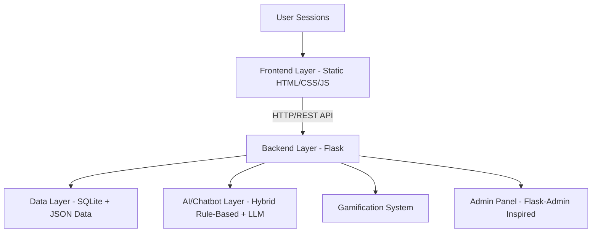

# CULTIA: Complete Architecture & Design Document

## Table of Contents
1. **Project Overview**
2. **High-Level System Architecture**
3. **Frontend Layer - Detailed Design**
4. **Backend Layer - Detailed Design**
5. **Data Layer - Detailed Design**
6. **AI & Chatbot Layer - Detailed Design (Core Focus)**
   - 6.1 Dataset Overview
   - 6.2 Algorithm & Model Stack
   - 6.3 Intent Detection Engine
   - 6.4 Tribes Data Manager
   - 6.5 Ollama/LLM Integration
   - 6.6 Wikipedia Integration
7. **Gamification System - Detailed Design**
8. **Admin Panel Architecture**
9. **Database Schema - Complete Details**
10. **API Design & Endpoints**
11. **Security Considerations**
12. **Deployment & Operations**
13. **Technology Stack Deep Dive**

---

## 1. Project Overview
CULTIA is an intelligent, gamified educational platform dedicated to preserving, celebrating, and teaching Cameroonian ethnic and cultural heritage.
- **Core Mission**: Make Cameroonian culture accessible, engaging, and fun for learners of all ages.
- **Target Users**: Students, educators, cultural enthusiasts, tourists, and the general public.
- **Core Features**:
  - AI-powered cultural chatbot
  - Interactive folklore stories
  - Cultural quizzes
  - Gamification (points, badges, leaderboards)
  - Virtual museum
  - Traditional music/masks showcase
  - Tribal comparison tool
  - Admin panel for content management

---

## 2. High-Level System Architecture


### Architecture Layers Breakdown
- **Frontend Layer**: Browser-based interface, static files served by Flask
- **Backend Layer**: Flask web server with Blueprints
- **Data Layer**: SQLite + structured JSON datasets
- **AI/Chatbot Layer**: Hybrid system combining rule-based knowledge retrieval with LLM fallbacks
- **Gamification Layer**: Points, badges, leaderboards, progress tracking
- **Admin Layer**: Content and user management

---

## 3. Frontend Layer - Detailed Design
### 3.1 File Structure
```
Frontends/
├── index.html               # Landing page
├── login.html               # User login page
├── register.html            # User registration page
├── features.html            # Feature showcase page
├── about.html               # About project page
├── explore.html             # Interactive explore page
├── contact.html             # Contact form page
├── css/                     # Stylesheets
│   └── styles.css
├── js/                      # Utility JavaScript
│   ├── main.js
│   └── themeManager.js
├── img/                     # Static images
└── bot/                     # Main application interface
    ├── dashboard.html       # User dashboard (core)
    ├── assistant.html       # AI assistant chat
    ├── storyteller.html     # Storyteller interface
    ├── quizzes.html         # Quiz interface
    ├── culturalRecipes.html # Traditional recipes
    ├── interactiveLanguageLearning.html # Language learning
    ├── culturalComparison.html # Tribe comparison
    ├── art_crafts.html      # Art and crafts
    ├── traditional_masks.html # Traditional masks
    ├── traditional_instruments.html # Traditional instruments
    ├── virtualMuseum.html   # Virtual museum
    ├── videoTestimonials.html # Testimonials
    ├── settings.html        # User settings
    ├── [12 folklore stories HTML files]
    │   ├── talking_python.html
    │   ├── magic_mirror.html
    │   └── ... (10 more)
    ├── includes/            # Shared components
    │   ├── header.html
    │   └── sidebar.html
    └── js/                  # Application-specific JS
        ├── gamification.js
        ├── settingsManager.js
        ├── storyteller.js
        ├── educator.js
        ├── assistant.js
        └── ...
```

### 3.2 Core Frontend Pages
#### Dashboard (dashboard.html)
- **Purpose**: User's main hub
- **Key Components**:
  - Stats widgets (Points, Stories Read, Badges)
  - Leaderboard display
  - Points to Earn section
  - Achievements showcase
  - Quick actions for quizzes, folklore, etc.

#### AI Assistant (assistant.html)
- **Purpose**: Chat with the culture-focused AI
- **Features**:
  - Two modes: "Educator" and "Personal Assistant"
  - Chat history
  - Response styling

#### Folklore Story Pages
- **Purpose**: Interactive folklore stories
- **Features**:
  - Story content with beautiful styling
  - Back button
  - Complete story button that awards points
  - Beautiful modal on completion
  - Theme support (light/dark)

### 3.3 Key Frontend Technologies & Libraries
- **HTML5**: Content structure
- **CSS3**: Responsive styling
- **Bootstrap 5**: Grid system, components, utilities
- **Vanilla JavaScript**: Application logic
- **AOS (Animate On Scroll)**: Scroll animations
- **Fetch API**: Backend communication
- **LocalStorage**: Theme and small state management

### 3.4 Frontend Modules
#### Gamification Module (js/gamification.js)
- Points display and update
- Badge management
- Leaderboard rendering
- Custom events for gamification state changes

#### Settings Manager (js/settingsManager.js)
- Light/Dark theme toggle
- Theme persistence
- Header/sidebar theme integration

---

## 4. Backend Layer - Detailed Design
### 4.1 File Structure
```
backend/
├── api.py               # Main Flask application
├── auth.py              # Authentication & gamification blueprint
├── config.py            # Configuration
├── users.db             # SQLite database
├── tribes_data.json     # Tribes data
└── quizzes_data.json    # Quiz data
```

### 4.2 api.py - Main Application
- **Framework**: Flask
- **Purpose**:
  - Serve frontend static files
  - Main API endpoints (chat, tribes, quizzes, achievements, etc.)
  - Database concurrency management

#### Key Components of api.py
##### 1. SQLite Concurrency Config
```python
def configure_sqlite():
    conn = sqlite3.connect(DB_PATH, timeout=30.0, check_same_thread=False)
    cursor = conn.cursor()
    cursor.execute("PRAGMA journal_mode=WAL")  # Write-Ahead Logging
    cursor.execute("PRAGMA synchronous=NORMAL")
    cursor.execute("PRAGMA cache_size=-64000")  # 64MB cache
    cursor.execute("PRAGMA foreign_keys=ON")
    conn.commit()
    conn.close()
```
- **WAL Mode**: Allows concurrent reads and writes to SQLite
- **30 Second Timeout**: Prevents "database is locked" errors
- **Check Same Thread**: False for better thread safety

##### 2. API Endpoints in api.py
| Endpoint | Method | Purpose |
|----------|--------|---------|
| / | GET | Serve index.html (landing page) |
| /api/features | GET | Get list of platform features |
| /api/me | GET | Check session for current user |
| /api/chat | POST | AI chatbot endpoint |
| /api/tribes | GET | Get all tribes data |
| /api/tribes/list | GET | Get tribes list for autocomplete |
| /api/quizzes | GET | Get quiz data |
| /api/quizzes/<quiz_id> | GET | Get specific quiz |
| /api/quiz-results | POST | Save quiz results |
| /api/quiz-history | GET | Get user quiz history |
| /api/leaderboard | GET | Get leaderboard |
| /api/achievements | GET/POST | Manage user achievements |
| /api/admin/* | * | Admin panel endpoints |

### 4.3 auth.py - Authentication & Gamification Blueprint
- **Blueprint**: `auth_bp`
- **Key Features**:
  - User registration, login, logout
  - Session management (Flask sessions)
  - Widget and folklore progress tracking
  - Gamification endpoints
  - New endpoint: `/api/folklore/completed-count` (for dashboard)

#### Auth Blueprint Endpoints
| Endpoint | Method | Purpose |
|----------|--------|---------|
| /auth/register | POST | Register new user |
| /auth/login | POST | Login user |
| /auth/logout | POST | Logout user |
| /auth/check | GET | Check if user is authenticated |
| /api/widgets | GET | Get available widgets |
| /api/widgets/<widget_id>/complete | POST | Complete widget and award points |
| /api/folklore/stories | GET | Get list of folklore stories |
| /api/folklore/progress | GET | Get user progress |
| /api/folklore/progress/<story_id> | POST | Update progress |
| /api/folklore/progress/<story_id>/complete | POST | Mark story as complete, award points |
| /api/folklore/completed-count | GET | Get count of completed stories |
| /api/dashboard/folklore-points | GET | Dashboard folklore data |
| /api/admin/gamification/settings | * | Admin gamification settings |

---

## 5. Data Layer - Detailed Design
### 5.1 SQLite Database (users.db)
- **Purpose**:
  - User accounts (authentication)
  - Achievements/badges
  - Gamification state
  - Quiz results
  - Folklore progress
  - Widget progress
  - Admin settings

### 5.2 JSON Data Files
#### 5.2.1 tribes_data.json
- **Structure**:
```json
{
  "metadata": { "description": "Cameroon is culturally diverse...", "country": "Cameroon" },
  "tribes": {
    "fulani_fulbe": {
      "name": "Fulani (Fulbe)",
      "location": { "region": "Adamawa Region" },
      "overview": "...",
      "customs_and_traditions": ["..."],
      "meals_and_cuisine_list": ["..."],
      "festivals_list": ["..."],
      "history": "...",
      "image_url": "..."
    },
    "...": "..."
  }
}
```
- **Contents**: ~50+ Cameroonian tribes, each with:
  - Name and aliases
  - Location/region
  - Overview
  - Customs/traditions
  - Traditional meals
  - Festivals
  - History
  - Image URL

#### 5.2.2 tribal_legends.json
- **Purpose**: Structured folklore and legends per tribe
- **Used by**: Storyteller mode

#### 5.2.3 quizzes_data.json
- **Purpose**: Quiz questions and answers
- **Structure**:
```json
{
  "quizzes": {
    "tribes": { ... },
    "culture": { ... },
    "history": { ... }
  }
}
```

---

## 6. AI & Chatbot Layer - Detailed Design (Core Focus)
This is the heart of CULTIA! Let's break it down in extreme detail!

### 6.1 Dataset Overview
#### 6.1.1 Primary Dataset: Tribes Knowledge Base
- **Source**: Structured JSON data (tribes_data.json, intelligent_tribes_data.json)
- **Data Points**:
  - 50+ Cameroonian ethnic groups
  - 20+ sections per tribe (history, culture, food, language, etc.)
  - Thousands of structured text entries
- **Data Collection**: Curated from cultural research, books, and academic sources
- **Data Format**: Hierarchical JSON (tribe → sections → content)

#### 6.1.2 Secondary Dataset: Wikipedia
- **Purpose**: Fallback for when local dataset is missing info
- **Integration**: Wikipedia REST API
- **Cache**: In-memory cache for performance

### 6.2 Algorithm & Model Stack
CULTIA uses a **HYBRID AI ARCHITECTURE**:

```
[User Query]
    ↓
[Step 1: Preprocessing & Normalization]
    ↓
[Step 2: Tribe Extraction (Regex + Fuzzy Matching)]
    ↓
[Step 3: Intent Detection (Regex Patterns + Scoring)]
    ↓
[Step 4: Hierarchical Knowledge Retrieval (from JSON)]
    ↓
[Step 5: Check if response is strong enough]
    ↓
    ├─→ [Strong] → [Return Structured Data Response]
    └─→ [Weak] → [Step 6: LLM Fallback (Gemini/Ollama)]
                    ↓
                [Enhanced LLM Response]
```

### 6.3 Core AI Components (from cameroon_chatbot.py)
#### Component 1: Text Normalizer
```python
def normalize_text(text: str) -> str:
    return re.sub(r'\s+', ' ', text.lower().strip())
```
- **Purpose**: Standardize input text for pattern matching and similarity
- **Algorithm**:
  - Convert to lowercase
  - Remove extra whitespace
  - Strip leading/trailing whitespace

#### Component 2: Tribe Extractor
```python
def extract_tribe_names(text: str) -> List[str]:
    # 1. Exact match
    # 2. Alias matching (e.g., "nso" → "nsaw")
    # 3. Fuzzy matching (SequenceMatcher)
```
- **Tribe Aliases Map**:
  ```python
  aliases = {
      "nso": "nsaw", "bamun": "bamum",
      "ewondo": "beti", "fang": "beti", "bulu": "beti",
      "bororo": "fulani", "fula": "fulani",
      "pygmy": "baka", "sawa": "duala",
      "grassfields": "bamileke"
  }
  ```
- **Fuzzy Matching Algorithm**: `difflib.SequenceMatcher` (ratio > 0.7)

#### Component 3: Intent Detector
- **Purpose**: Identify what the user is asking about
- **Pattern Matching**: Regex patterns for 20+ intent categories
- **Intent Categories**:
  | Category | Description |
  |----------|-------------|
  | overview | General about a tribe |
  | core_identity | Identity and structure |
  | leadership | Chiefs, governance |
  | worldview | Cosmology, creation |
  | spirituality | Spirits, ancestors |
  | religion | Religion, beliefs |
  | rituals | Rituals, ceremonies |
  | subsistence | Farming, herding |
  | food | Cuisine, meals |
  | technology | Tools, crafts |
  | shelter | Architecture |
  | clothing | Traditional attire |
  | history | History, origin |
  | colonialism | Colonial era |
  | modern_life | Contemporary times |
  | politics | Politics |
  | economy | Economy |
  | oral_tradition | Stories, legends |
  | visual_arts | Art, crafts |
  | music_dance | Music, dance |
  | traditional_knowledge | Indigenous knowledge |
  | compare | Compare two tribes |

- **Scoring System**:
  - High priority patterns get 5.0 points
  - Standard patterns get 1.0 point per match
  - Tie-breaker: Specificity ranking (more specific intent wins)

#### Component 4: Tribes Data Manager
- **Core Class**: `TribesDataManager`
- **Purpose**: Load and query tribes dataset
- **Methods**:
  1. `load_data()`: Parse JSON file
  2. `build_search_index()`: Build keyword, category, and alias indices
  3. `get_tribe_data(tribe_name)`: Get all data for a tribe
  4. `get_tribe_section(tribe_name, section)`: Get specific section
  5. `search_by_keywords(keywords)`: Keyword search
  6. `search_by_content(query, tribe_filter)`: Full-text similarity search
  7. `compare_tribes(tribe_names)`: Compare multiple tribes

- **Search Algorithms**:
  - **Keyword Index**: Inverted index from keywords to tribes
  - **Full-Text Similarity**: SequenceMatcher ratio
  - **Category Index**: Map categories to tribes

#### Component 5: Smart Response Generator
- **Core Class**: `SmartResponseGenerator`
- **Response Pipeline**:
  1. Check query is in scope
  2. Extract mentioned tribes
  3. Detect primary intent
  4. Retrieve relevant data from JSON
  5. If weak, try Wikipedia fallback
  6. If still weak, try LLM fallback
  7. Return final response

### 6.4 LLM Integration
#### 6.4.1 Primary Fallback: Google Gemini
- **Model Priority List**:
  1. `gemini-2.0-flash` (fastest)
  2. `gemini-1.5-flash`
  3. `gemini-pro`
- **Purpose**: Generate enhanced natural language responses when local data is weak
- **API Access**: Google Generative AI SDK
- **Location**: `api.py` → `call_gemini_fallback()`
- **Prompt Engineering**:
  ```python
  prompt = (
      "You are CULTIA, a warm, knowledgeable cultural companion...\n"
      f"Question: {user_input}"
  )
  ```

#### 6.4.2 Secondary Fallback: Ollama (Optional)
- **Model**: Default `llama3.2` (configurable via environment variable)
- **Class**: `OllamaClient` (from cameroon_chatbot.py)
- **Usage**:
  - Local LLM for privacy and offline use
  - Uses Ollama HTTP API (localhost:11434)
  - Fallback to subprocess if HTTP fails

### 6.5 Wikipedia Integration
- **Class**: `WikipediaExtractor`
- **Purpose**: Enhance responses with real-time Wikipedia data
- **Methods**:
  1. `search_wikipedia(query, tribe_name)`: Search Wikipedia
  2. `get_page_summary(page_title)`: Get page summary via Wikipedia REST API
- **Cache**: In-memory dictionary for performance

---

## 7. Gamification System - Detailed Design
### 7.1 Core Gamification Concepts
- **Points**: Earned for completing tasks (stories, widgets, quizzes)
- **Badges**: Earned for milestones
- **Leaderboard**: Rank users by total points
- **Progress Bars**: Show weekly goal completion

### 7.2 Gamification Database Tables
1. **widgets**: List of available widgets
2. **widget_completions**: User widget completions
3. **folklore_stories**: List of folklore stories
4. **folklore_progress**: User progress per story
5. **point_transactions**: Log of all points changes
6. **gamification_settings**: Points per widget/story, etc.

### 7.3 Gamification Flow
```
[User Completes Task (e.g., story)]
    ↓
[Backend checks if already completed]
    ↓
[If not, award points and mark complete]
    ↓
[Update folklore_progress, point_transactions]
    ↓
[Dispatch gamification_update custom event]
    ↓
[Frontend listens for event → updates stats, leaderboard, etc.]
```

---

## 8. Admin Panel Architecture
- **Purpose**: Manage users, content, and gamification
- **Location**: `../admin/` (relative to backend)
- **Components**:
  - `admin.py`: Admin backend
  - `templates/admin/`: Admin HTML templates
  - `static/admin/`: Admin CSS, JS, images
- **Admin Features**:
  - User management (create, edit, delete, role change)
  - Gamification settings
  - Achievements management
  - Improvements tracking
  - Maintenance mode
  - Registration toggle
  - AI toggle

---

## 9. Database Schema - Complete Details
```sql
-- ------------------------------
-- Users Table (Authentication)
-- ------------------------------
CREATE TABLE users (
    id INTEGER PRIMARY KEY AUTOINCREMENT,
    first_name TEXT NOT NULL,
    last_name TEXT NOT NULL,
    email TEXT NOT NULL UNIQUE,
    password TEXT NOT NULL,  -- Hashed (werkzeug)
    country TEXT,
    interest TEXT,
    profile_pic TEXT,
    role TEXT DEFAULT 'user',  -- 'user' or 'admin'
    created_at TIMESTAMP DEFAULT CURRENT_TIMESTAMP
);

-- ------------------------------
-- Achievements & Points
-- ------------------------------
CREATE TABLE achievements (
    id INTEGER PRIMARY KEY AUTOINCREMENT,
    user_id INTEGER,
    achievement_type TEXT,  -- e.g., 'badge', 'points'
    achievement_name TEXT,
    achievement_description TEXT,
    points INTEGER DEFAULT 0,
    earned_at TIMESTAMP DEFAULT CURRENT_TIMESTAMP,
    FOREIGN KEY (user_id) REFERENCES users (id)
);

-- ------------------------------
-- Quiz Results
-- ------------------------------
CREATE TABLE quiz_results (
    id INTEGER PRIMARY KEY AUTOINCREMENT,
    user_id INTEGER,
    quiz_id TEXT,
    score INTEGER,
    total_questions INTEGER,
    percentage REAL,
    date_taken TIMESTAMP DEFAULT CURRENT_TIMESTAMP,
    FOREIGN KEY (user_id) REFERENCES users (id)
);

-- ------------------------------
-- Widgets & Completions
-- ------------------------------
CREATE TABLE widgets (
    id INTEGER PRIMARY KEY AUTOINCREMENT,
    name TEXT,
    description TEXT,
    points INTEGER DEFAULT 0,
    type TEXT
);

CREATE TABLE widget_completions (
    id INTEGER PRIMARY KEY AUTOINCREMENT,
    user_id INTEGER,
    widget_id INTEGER,
    completed_at TIMESTAMP DEFAULT CURRENT_TIMESTAMP,
    FOREIGN KEY (user_id) REFERENCES users (id),
    FOREIGN KEY (widget_id) REFERENCES widgets (id)
);

-- ------------------------------
-- Folklore Stories & Progress
-- ------------------------------
CREATE TABLE folklore_stories (
    id INTEGER PRIMARY KEY AUTOINCREMENT,
    story_id TEXT UNIQUE,  -- e.g., 'talking_python'
    title TEXT,
    tribe TEXT,
    description TEXT,
    base_points INTEGER DEFAULT 10,
    content TEXT
);

CREATE TABLE folklore_progress (
    id INTEGER PRIMARY KEY AUTOINCREMENT,
    user_id INTEGER,
    story_id TEXT,
    current_progress INTEGER DEFAULT 0,
    is_completed INTEGER DEFAULT 0,  -- Boolean (0/1)
    completed_at TIMESTAMP,
    FOREIGN KEY (user_id) REFERENCES users (id)
);

-- ------------------------------
-- Gamification Settings
-- ------------------------------
CREATE TABLE gamification_settings (
    id INTEGER PRIMARY KEY CHECK (id = 1),
    points_per_widget INTEGER DEFAULT 10,
    points_per_folklore INTEGER DEFAULT 20,
    weekly_goal INTEGER DEFAULT 10
);

-- ------------------------------
-- Point Transactions (Audit Log)
-- ------------------------------
CREATE TABLE point_transactions (
    id INTEGER PRIMARY KEY AUTOINCREMENT,
    user_id INTEGER,
    points INTEGER,
    reason TEXT,
    created_at TIMESTAMP DEFAULT CURRENT_TIMESTAMP,
    FOREIGN KEY (user_id) REFERENCES users (id)
);

-- ------------------------------
-- Admin Settings
-- ------------------------------
CREATE TABLE admin_settings (
    id INTEGER PRIMARY KEY CHECK (id = 1),
    maintenance INTEGER DEFAULT 0,  -- Boolean
    registrations INTEGER DEFAULT 1, -- Boolean
    ai INTEGER DEFAULT 1,
    storyteller INTEGER DEFAULT 1,
    verification INTEGER DEFAULT 0,
    updated_at TIMESTAMP DEFAULT CURRENT_TIMESTAMP
);

CREATE TABLE admin_improvements (
    id INTEGER PRIMARY KEY AUTOINCREMENT,
    title TEXT NOT NULL,
    description TEXT,
    status TEXT DEFAULT 'Planned',
    created_at TIMESTAMP DEFAULT CURRENT_TIMESTAMP
);
```

---

## 10. API Design & Endpoints
### Complete API Endpoint List
#### Authentication
- `POST /auth/register`: Registers user
- `POST /auth/login`: Logs user in
- `POST /auth/logout`: Logs user out
- `GET /auth/check`: Checks auth status

#### Gamification & Folklore
- `GET /api/widgets`: Get widgets
- `POST /api/widgets/<widget_id>/complete`: Complete widget
- `GET /api/folklore/stories`: Get stories list
- `GET /api/folklore/progress`: Get user progress
- `POST /api/folklore/progress/<story_id>`: Update progress
- `POST /api/folklore/progress/<story_id>/complete`: Complete story
- `GET /api/folklore/completed-count`: Completed story count
- `GET /api/dashboard/folklore-points`: Dashboard folklore data

#### Chatbot & Tribes
- `POST /api/chat`: Chat with AI
- `GET /api/tribes`: Get all tribes data
- `GET /api/tribes/list`: Get tribes list for autocomplete

#### Quizzes
- `GET /api/quizzes`: Get all quizzes
- `GET /api/quizzes/<quiz_id>`: Get quiz by ID
- `POST /api/quiz-results`: Save quiz result
- `GET /api/quiz-history`: Get quiz history

#### Leaderboard & Achievements
- `GET /api/leaderboard`: Get leaderboard
- `GET /api/achievements`: Get user achievements
- `POST /api/achievements`: Add achievement

#### Admin Endpoints
- `GET /api/admin/stats`: Get admin stats
- `GET /api/admin/users`: Get all users
- `POST /api/admin/user/role`: Update user role
- `DELETE /api/admin/user/<user_id>`: Delete user
- `GET/PUT /api/admin/settings`: Manage admin settings
- `GET/POST /api/admin/improvements`: Manage improvements

---

## 11. Security Considerations
### 11.1 Authentication
- **Password Hashing**: Werkzeug's `generate_password_hash` and `check_password_hash`
- **Session Management**: Flask secure cookies
- **Role-Based Access Control**: 'user' vs 'admin' roles
- **Admin-only endpoints protected with decorators

### 11.2 Database
- **SQL Injection Prevention**: Parameterized queries only (no string formatting!)
- **SQLite WAL Mode**: Better concurrency
- **Timeout**: 30 seconds to avoid locks
- **Thread Locking**: `threading.Lock()` for shared DB access

### 11.3 API
- **CORS**: Flask-CORS configured to support credentials
- **Input Validation**: Check all user input
- **Rate Limiting**: (Future improvement)

---

## 12. Deployment & Operations
### 12.1 Starting the Application
#### Backend
```bash
cd Robix/Robix/backend
python api.py
# Or use the batch file
start_backend.bat
```
- Default port: `5000`
- Frontend served from `../Frontends/`

#### Admin Panel (Optional)
```bash
cd ..
python admin.py
```

### 12.2 Dependencies
- **Backend Requirements**:
  - Flask
  - Flask-CORS
  - Werkzeug
  - google-generativeai (optional)
  - sqlite3 (built-in)

---

## 13. Technology Stack Deep Dive
### 13.1 Core Technologies
#### Backend
| Tech | Version/Purpose |
|------|-----------------|
| Python | 3.x (Primary language) |
| Flask | Lightweight web framework |
| Flask-CORS | Cross-origin resource sharing |
| SQLite | Embedded SQL database |
| Werkzeug | Password hashing, utilities |
| Google Generative AI | Gemini LLM fallback |
| threading | Concurrency and locking |

#### Frontend
| Tech | Purpose |
|------|---------|
| HTML5 | Content structure |
| CSS3 | Styling and responsive design |
| Bootstrap 5 | UI components and grid |
| Vanilla JavaScript | Application logic |
| Fetch API | HTTP client for backend |
| LocalStorage | Persist theme and small data |
| AOS Library | Scroll animations |

#### AI & Chatbot
| Component | Purpose |
|-----------|---------|
| Regex Patterns | Intent detection and tribe extraction |
| difflib.SequenceMatcher | Fuzzy string matching |
| Inverted Indices | Fast keyword search |
| Wikipedia REST API | External knowledge fallback |
| Google Gemini API | Advanced LLM fallback |
| Ollama (Optional) | Local LLM |

### 13.2 Why This Stack?
- **Flask**: Simple, flexible, perfect for this scale
- **SQLite**: Embedded, no server, perfect for small-to-medium scale
- **Hybrid AI**: Rule-based for speed and reliability, LLM for flexibility
- **Static Frontend**: Simple to serve, fast to load
- **Bootstrap 5**: Responsive out of the box, well-documented
