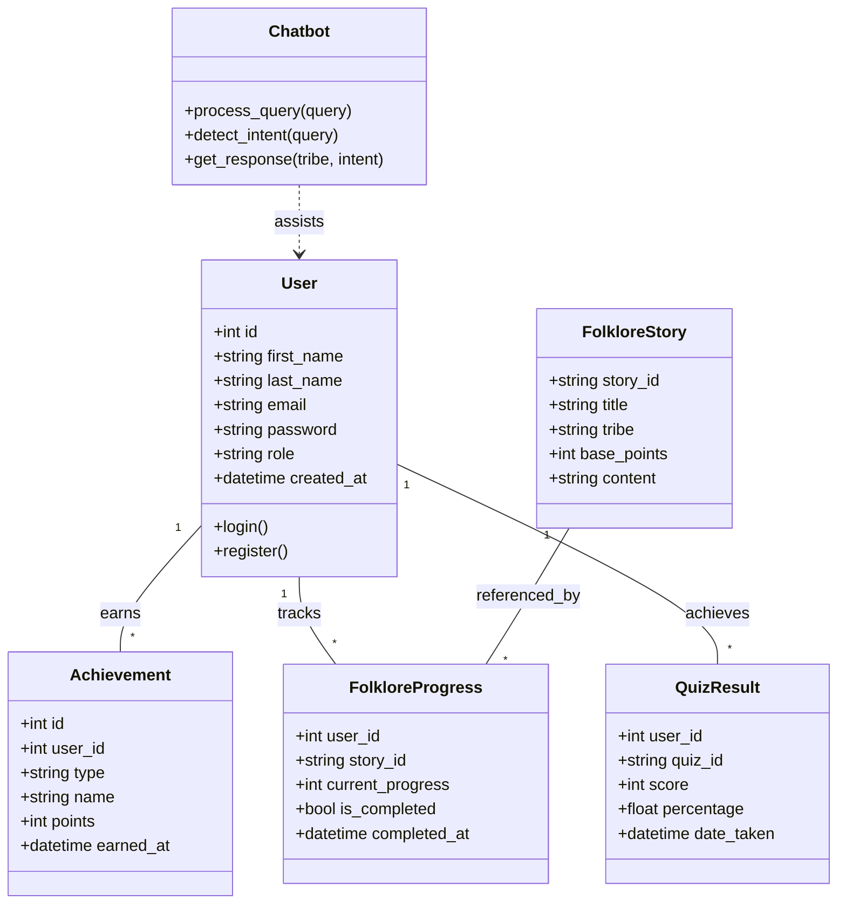
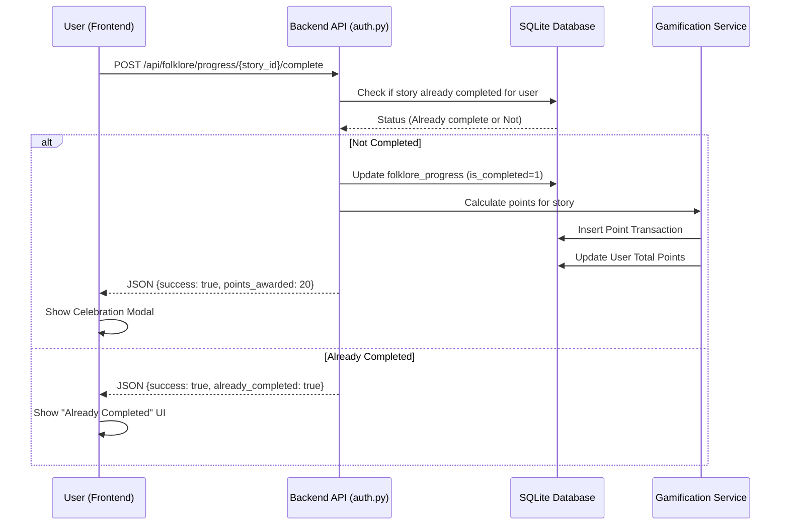
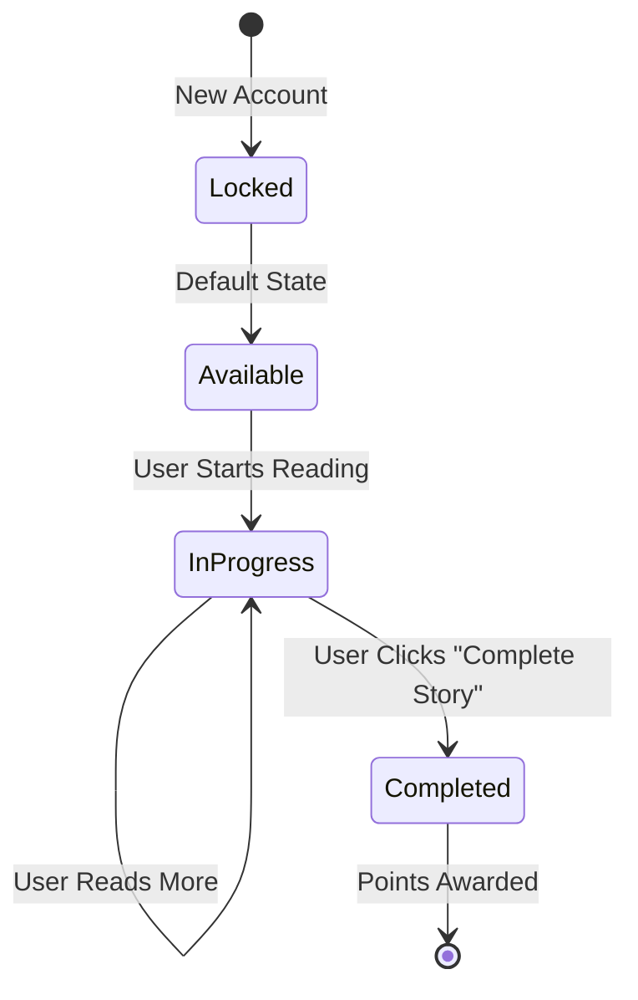
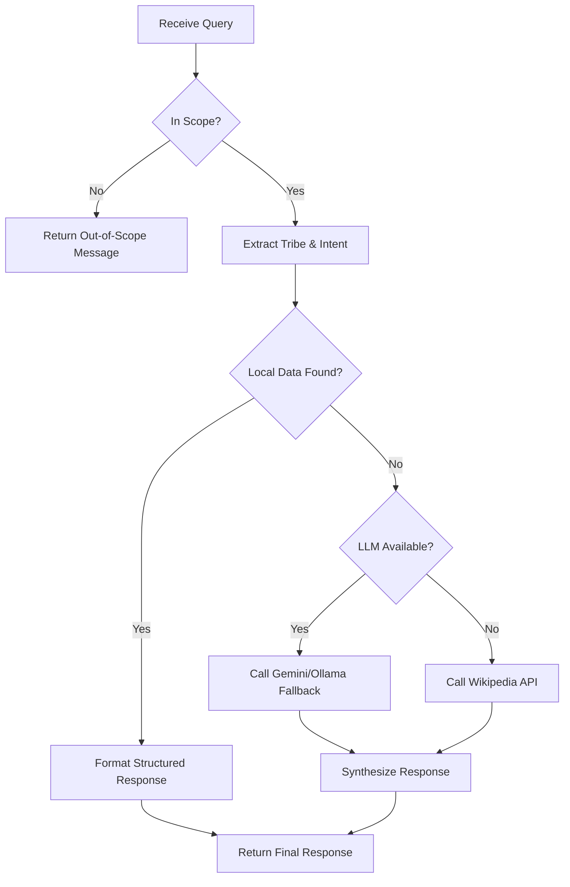

# CULTIA - Complete UML Design Specifications

This document provides a graphical representation of the CULTIA platform using UML diagrams (Mermaid syntax). It covers the system's structure, behavior, and interactions.

---

## 1. Component Diagram (System Architecture)
The component diagram shows the high-level organization of the CULTIA system and the dependencies between its major parts.

```mermaid
componentDiagram
    component [Frontend Layer] as Frontend
    component [Backend API (Flask)] as Backend
    component [AI/Chatbot Engine] as AI
    component [Database (SQLite)] as DB
    component [External Services] as External
    component [Admin Panel] as Admin

    Frontend --> Backend : REST API (JSON)
    Backend --> DB : SQL Queries
    Backend --> AI : Knowledge Retrieval
    AI --> DB : JSON Data (Tribes/Legends)
    AI --> External : Gemini/Wikipedia APIs
    Admin --> Backend : Admin API Endpoints
    Admin --> DB : Management Queries
```

---

## 2. Use Case Diagram
This diagram illustrates the primary interactions between different actors (User, Admin) and the system.

```mermaid
useCaseDiagram
    actor "User" as User
    actor "Admin" as Admin

    package "CULTIA Platform" {
        usecase "Register/Login" as UC1
        usecase "Chat with Cultural AI" as UC2
        usecase "Read Folklore Stories" as UC3
        usecase "Complete Quiz" as UC4
        usecase "View Dashboard & Points" as UC5
        usecase "Learn Languages" as UC6
        usecase "Manage Users" as UC7
        usecase "Configure Gamification" as UC8
        usecase "Review Analytics" as UC9
    }

    User --> UC1
    User --> UC2
    User --> UC3
    User --> UC4
    User --> UC5
    User --> UC6

    Admin --> UC7
    Admin --> UC8
    Admin --> UC9
    Admin --|> User : Inherits Actions
```

---

## 3. Class Diagram (Backend & Data Models)
The class diagram represents the structure of the backend application, focusing on the data models and the relationships between them.



---

## 4. Sequence Diagram (Story Completion Flow)
This diagram details the step-by-step process of a user completing a folklore story and receiving rewards.



---

## 5. State Diagram (Folklore Story Progress)
This diagram shows the various states a story can have for a particular user.



---

## 6. Activity Diagram (AI Chat Processing)
This diagram describes the logical flow of the AI chatbot when processing a user query.


